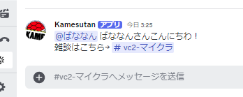

# かめぱわぁーるどようこそメッセージBOT

## 概要
このBOTは、Discordサーバーに新しいメンバーが参加した際に、定義済みのテンプレートメッセージを利用して歓迎メッセージを送信するBOTです。  
ユーザーをメンションし、ニックネームも表示することができます。


## 機能
- 新しいメンバーが参加すると自動でメッセージを送信
- ユーザーのメンションを表示
- ユーザーのニックネームを表示
- メッセージテンプレートを指定して送信
- TOMLファイルを用いて構成を管理

## 使い方

### 依存パッケージのインストール
```sh
npm install
```

### `config.toml`の準備
初回起動時に`config.toml`が存在しなければ自動的に`config.default.toml`からコピーされます。
設定値を更新してください。

### TypeScriptをビルド
```sh
npm run build
```

### BOTの起動
```sh
npm start
```

## 設定ファイル (config.toml) 例
```toml
some_text_setting = "ようこそ!"
channel_id = "WELCOME_CHANNEL_ID"
template_message_id = "TEMPLATE_MESSAGE_ID"
```

## .envファイル
```sh
DISCORD_TOKEN=YOUR_DISCORD_BOT_TOKEN
```

## 備考
- `config.toml`は`.gitignore`に入れることを推奨。
- メッセージテンプレートは`{userMention}`や`{userNickname}`のようなプレースホルダーを含めることが可能。

